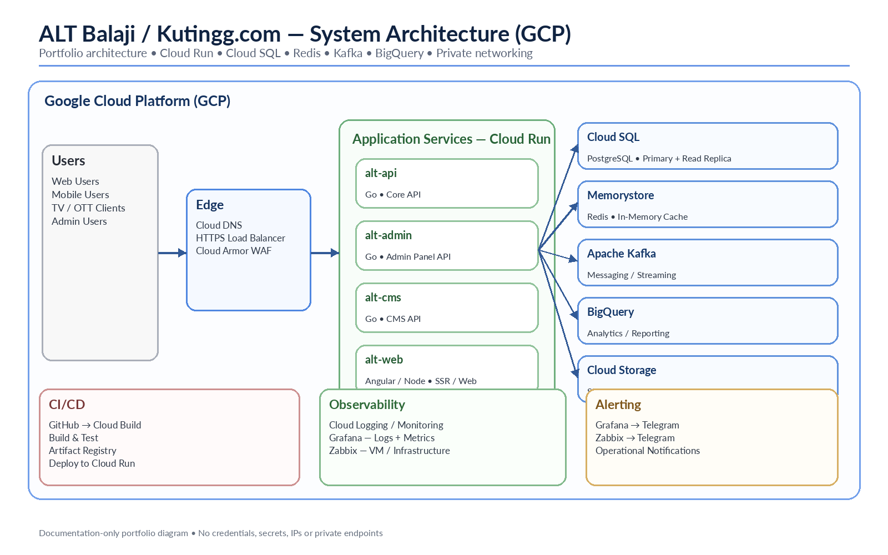

# ALT Balaji / Kutingg.com System Architecture

The architecture reflects the supplied portfolio reference: Cloud DNS, HTTPS Load Balancer and Cloud Armor, Cloud Run application services, Cloud SQL primary/read replica, Memorystore Redis, Kafka, BigQuery, Cloud Storage, GitHub/Cloud Build/Artifact Registry CI/CD, and the common Grafana/Zabbix/Telegram monitoring model.
